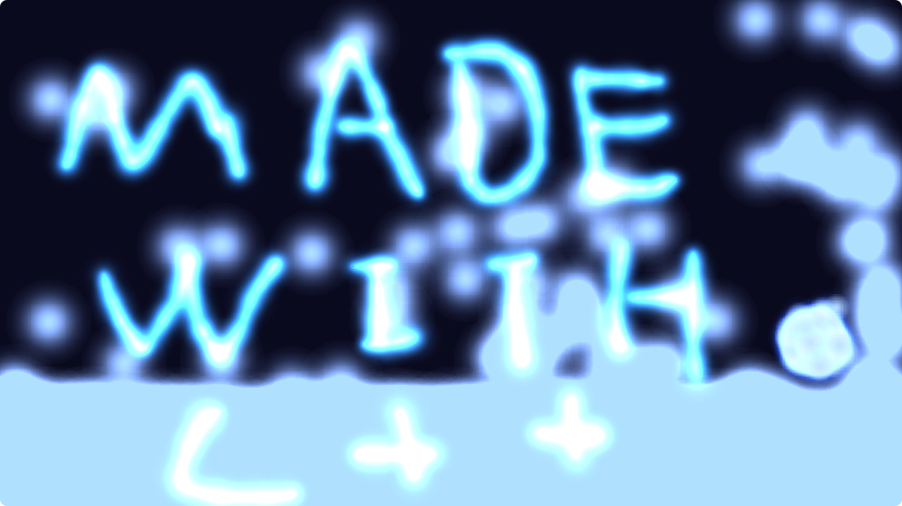

# senior-particle-Art

A real-time, interactive particle art simulation project powered by C++ and SDL2.28.2. Here, you can command cool alien creatures and wield your “paintbrush” to create your own piece of the universe.

#for developers

**Dependencies**:

C++17

SDL2.28.2

miniaudio
